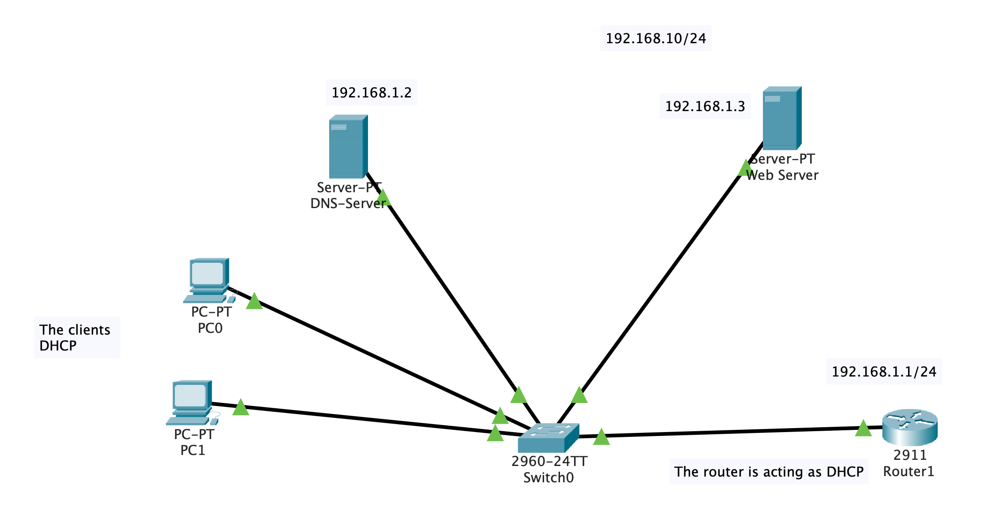

Router>enable  
Router#configur t 

Router(config)#hostname Nasser-Router 

Nasser-Router(config)#interface gigabitEthernet 0/0 
Nasser-Router(config-if)#ip 
Nasser-Router(config-if)#ip address 
Nasser-Router(config-if)#ip address 192.168.1.1 255.255.255.0 
Nasser-Router(config-if)#no sh 
Nasser-Router(config-if)#no shutdown  

## Configur DHCP 
Router#configur t 
Nasser-Router(config)#service dhcp 
Nasser-Router(config)#ip dhcp pool Net-Pool 
Nasser-Router(dhcp-config)#network 192.168.1.0 255.255.255.0 
Nasser-Router(dhcp-config)#default-router 192.168.1.1 
Nasser-Router(dhcp-config)#dns-server 192.168.1.2 
Nasser-Router(dhcp-config)#domain-name nasser.com 
Nasser-Router(dhcp-config)#ip dhcp excluded-address 192.168.1.1 192.168.1.10 
Nasser-Router(config)#exit 
Nasser-Router#w  

---

